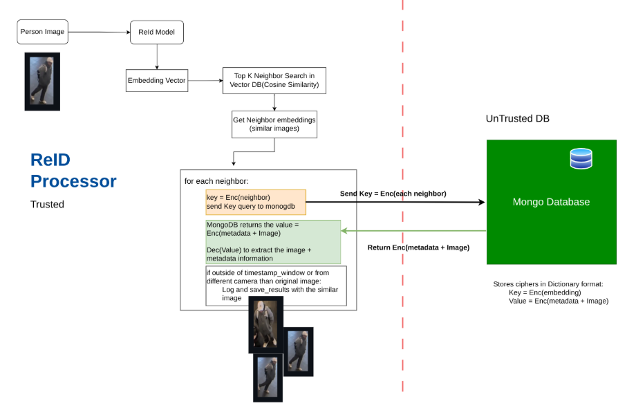

# Secure Object Detection and Re-Identification System

This is the edge component of the distributed TransReID system responsible for real-time frame processing and object detection. It captures video frames from cameras or video files, detects persons and vehicles using YOLO, preprocesses the detected objects for Re-Identification (ReID), and sends the processed data to the C2 container which performs Object Re-Identification (ReID) via Redis queue for feature extraction and matching. We use Weaviate as a vector database for storing and querying embeddings. We use an untrusted NoSQL database to store the images in an encrypted format.

> This Repo is a typical real-time object detection and re-identification system. We are simulating the physical servers with Docker Containers system. Typically, we could also run these manually on different machines for deployment.




### Structure:

- C1: Edge Frame Processor
- C2: Object Re-Identification Processor
- Redis: Message Queue to transfer data from C1 (multiple) to C2 system
- Weaviate: Vector Database for storing and querying embeddings
- Mongo: NoSQL Database for storing images in an encrypted format

## C1 - Edge Frame Processor

### Overview

C1 is the edge component of the distributed TransReID system responsible for real-time frame processing and object detection. It captures video frames from cameras or video files, detects persons and vehicles using YOLO, preprocesses the detected objects for Re-Identification (ReID), and sends the processed data to the C2 container via Redis queue for feature extraction and matching.

## Features

- **Real-time Object Detection**: Uses YOLOv8 for detecting persons and vehicles
- **Multi-object Support**: Handles both person ReID and vehicle ReID with appropriate preprocessing
- **Edge Processing**: Lightweight container designed for edge deployment
- **Redis Integration**: Efficient queue-based communication with C2 container
- **Flexible Input**: Supports both live camera feeds and video file processing
- **GPU Support**: Optional GPU acceleration for YOLO inference
- **Logging**: Comprehensive logging with file persistence and Docker logs

## Architecture

### C1 - Camera Systems 

```
Camera/Video → YOLO Detection → Object Cropping → ReID Preprocessing → Redis Queue 
```

### C2 - Object Re-Identification Processor

```
Redis Queue → Feature Extraction → ReID Matching → Encryption → Mongo Storage
```

## Requirements

### System Requirements
- Docker & Docker Compose
- NVIDIA GPU (optional, for YOLO acceleration)
- Camera device or video files

### Dependencies
- PyTorch 2.1.0+
- YOLOv8 (Ultralytics)
- OpenCV
- Redis
- PIL/Pillow

## Installation

### 1. Clone Repository
```bash
git clone <repository-url>
cd ReId/C1
```

### 2. Build Docker Image
```bash
docker build -t c1_processor .
```

### 3. Download YOLO Weights (Optional)
Weights are automatically downloaded on first run, or manually:
```bash
mkdir -p models
wget https://github.com/ultralytics/assets/releases/download/v0.0.0/yolov8n.pt -O models/yolov8n.pt
```

## Usage

### Docker Compose (Recommended)
```bash
# Start the entire system
docker-compose up

# Start only C1
docker-compose up c1_processor

# Start in background
docker-compose up -d c1_processor
```

[Running C1](./C1/README.md)

# C2:ReID Processing System

This system processes ReID data from C1 and stores it in a vector database. Querying the database allows for efficient retrieval of similar objects.

## Integration with C2

C1 sends processed object data to Redis queue `object_queue` where C2 container:
1. Receives cropped and preprocessed objects
2. Runs TransReID feature extraction
3. Queries Similarity Search
4. Stores results in database

<!--## Contributing

[Add contribution guidelines here]-->

## Support

For issues and questions:
- Check logs: `docker logs c1_processor`
- Review troubleshooting section
- Submit issues to repository

---

**Note**: This container is designed for edge deployment and should be paired with C2 container for complete ReID functionality.
