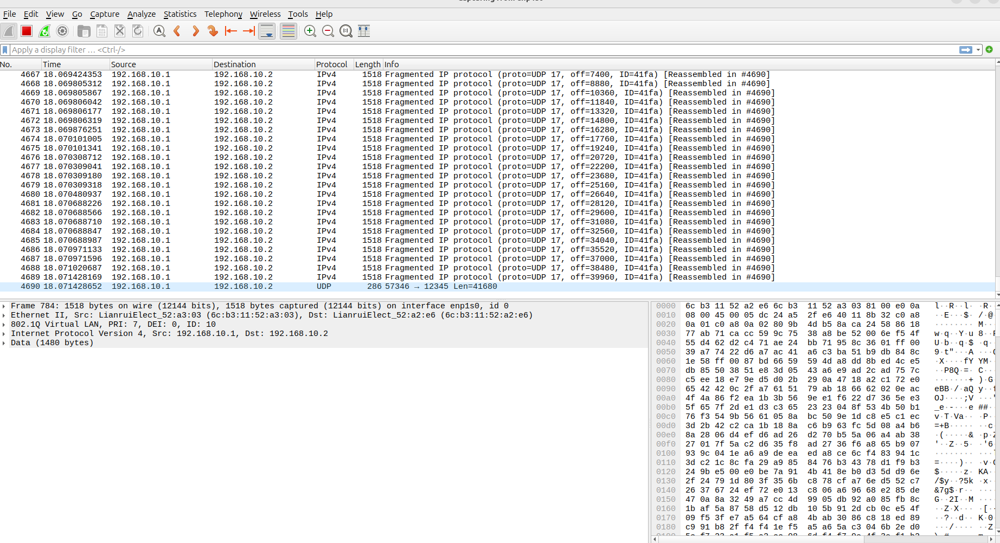
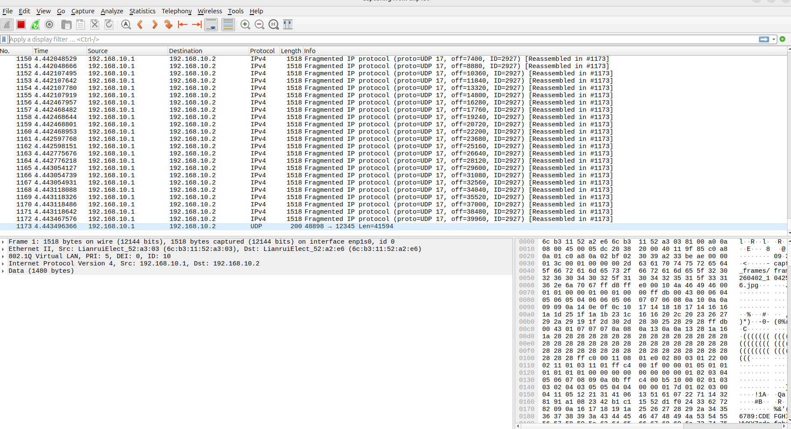
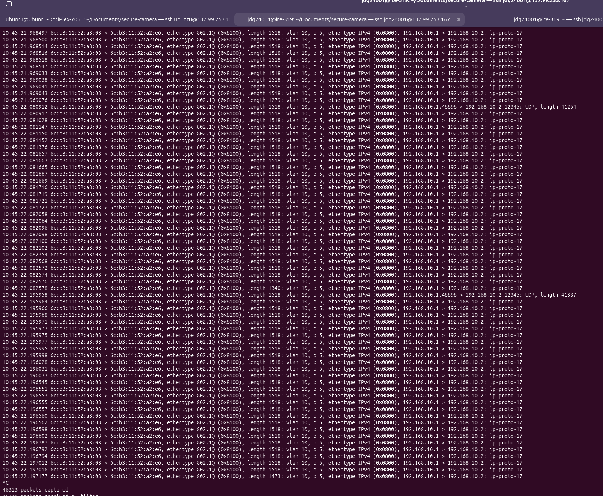
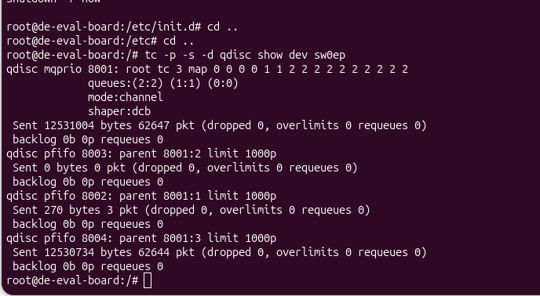

# Secure Multi Camera Project 


Overall Project Architecture: 


[Camera 1 at UCONN D04838 ]------>

				[TSN Switch] -----> [Server (Receiver) at UCONN D06480 ]

[Camera 2 (Not configured yet due to having no resource)] ------> 


## Computer Information 

### Computer 1: UCONN D04838 (Sender)


User: ubuntu 

password: 
IP: 137.99.253.188

This is connected to Swich port sw0p2 of the TSN switch 

CPU Configuration: Intel(R) Core(TM) i7-7700 CPU @ 3.60GHz


### Computer 1: UCONN D06480  

User: NetID
Pass: 
IP: 137.99.253.167 

This is connected to Swich port sw0p3 of the TSN switch 

CPU Configuration:   Intel(R) Core(TM) i5-8500 CPU @ 3.00GHz

### NIC information 

Intel Corporation I210 Gigabit Network Connection


## VLAN Configuration 


Created a vlan with ID 10 in order to add priority in the frame. 

I run the following command at both sender and receiver

```
sudo ip link add link enp1s0 name enp1s0.10 type vlan id 10

sudo ip addr add 192.168.10.1/24 dev enp1s0.10 # sender
sudo ip addr add 192.168.10.2/24 dev enp1s0.10 # receiver 
sudo ip link set dev enp1s0.10 up
```

```sudo ip link set enp1s0.10 type vlan egress-qos-map \
0:0 1:1 2:2 3:3 4:4 5:5 6:6 7:7
```


We will use this VLAN ID and IP address along with interface enp1s0.10 in all future communication 

In addition, we must make sure that the created VLAN is tagged because in untagged vlan pcp does not work and we may not able to see 802.1Q frame description 


## TSN SWITCH Configuration 

TSN switch IP: 192.168.0.2


Run this command to map socket priority tagging: 

```
sudo ip link set enp1s0.10 type vlan egress-qos-map \  
0:0 1:1 2:2 3:3 4:4 5:5 6:6 7:7
```

We may also need to load module in both switch and computer node if 8021q is not available 

```
sudo modprobe 8021q 
ip link show
```

### Show mapping
```
tsntool brport rdtctbl sw0p3
```


### Force 1:1 mapping (PCP `n` → TC `n`)

```
for pcp in 0 1 2 3 4 5 6 7; do  
	tsntool brport wrtctbl $pcp $pcp sw0p3  
done
```


### Configure CBS on TC4 and TC5 (per port)

CBS config uses `tsntool fqtss`:

1. set idleSlope (reserved bandwidth/per second)
```
tsntool fqtss slope 4 100000000 sw0p3 
tsntool fqtss slope 5 100000000 sw0p3
```
1. set TSA to `cbs` for that TC
    

**Activate the CBS algorithm** for those classes:

```
tsntool fqtss tsa 4 cbs sw0p3
tsntool fqtss tsa 5 cbs sw0p3
```

To verify 

```
tsntool fqtss show sw0p3
```
### Configure TAS / 802.1Qbv on TC6–TC7 


```
tsntool st show sw0p3
```

Create a schedule file as  tas_cbs_be.cfg

```
sgs 32000 0x40 # 01000000
sgs 32000 0x80 # 10000000
sgs 32000 0x30 # 00110000
sgs 32000 0x0F # 00001111

```

write configuration to admincontrol list 

```
tsntool st wrcl sw0p3 tas_cbs_be.cfg
```

To load this schedule to the OperControlList so that it gets taken into use, call this command:

```
tsntool st configure +0.0 16/125000 0 sw0p3 # 128/1,000,000=16/125,000
```

Write and activate the schedule:
```
tsntool st wrcl sw0p3 tas_cbs_be.cfg
tsntool st configure +0.0 16/125000 0 sw0p3 # 128/1,000,000=16/125,000
```

To check configure is written to the particular interface

```
tsntool st rdacl sw0p3
```

To confirm Qbv is enabled:

```
tsntool st show sw0p3
```


## Confirmation of Working VLAN


In order to verify whether the VLAN configuration is working correctly, we used Wireshark and tcpdump

I can see from the wireshark packet that packet is being transmitted considering the given VLAN information and Priority 








I have also test using tcpdump using command: 

```
sudo tcpdump -i enp1s0 -e -nn vlan
```





## Camera Configuration 

This is a very old logitech camera, I collected it from UCONN surplus


## Sender and receiver configuration 


```
sudo tc qdisc add dev enp1so parent root handle 6666 mqprio \
        num_tc 3 \
        map 2 2 1 0 2 2 2 2 2 2 2 2 2 2 2 2 \
        queues 1@0 1@1 2@2 \
        hw 0

```

Running the sender: 

```
python main.py
```

This command will turn on camera and start capturing the frame. In addition, it sends frame to receiver over the vlan and ip: 192.168.10.2 

At the receiver, run command: 

``` python receiver-db.py
```

This will captures frames and saves into sqllite databse: received_images.db 


### Database Configuration 

open a database:  

```sqlite3 received_images.db
```

view all records: 
```
SELECT * FROM received_images;
```


get the latest image: 

```SELECT * FROM received_images
ORDER BY id DESC
LIMIT 1;```

exit from db: 
```
.exit
```


## Challenges 


Currently, queue assignment based on the PCP value in 802.1Q is working properly 

Because running this command:  ```tc -p -s -d qdisc show dev sw0ep``` shows only 8001:3 is being used. 




